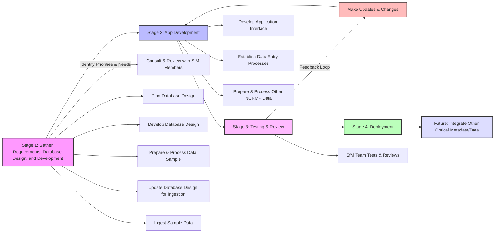

#
# **Optical Metadata Application & Database**

## **Statement**

This application & database is designed to increase efficiency and streamline data entry, access and retrieval of optical metadata via standardization within our Oracle database systems. The app would address the immediate need to optimize Structure-from-Motion (SfM) imagery metadata entry, and act as a solid foundation for other optical data management, data entry, quality control, and access of other optical data.

## **Purpose**

**Streamline Data Entry & Validation**

- The primary purpose would be to transition from manual data entry of SfM metadata entered in a google sheet to an app interface. Requested by SfM team members, the new system would help to:
  - Reduce errors
  - Reduce time required to enter
  - Allow us to employ validations & other database procedures for processing
  - And implement other best practices for data management

**Enhance Data Integration, Integrity & Accessibility**

- With SfM established as an NCRMP(National Coral Reef Monitoring Program) datastream, its integration into our Oracle database systems is a natural evolution of the data streams maturity.
- The integration is crucial for enabling faster and better:
  - Data integration with our other NCRMP data streams
  - Data retrieval
  - Data archive
- The integration also ensures
  - consistency
  - reliability
  - and streamlines access

**Optimize Post-Collection Processing**

- The foundation for this application could also include modules that involve starting the optical validation QC process for photo quads while on the cruise, reducing the amount of time spent in optical validation post-cruise.
- In addition, support and link to other post collection processing apps in development like the SfM annotation app

## **Development Stages**
### Stage 1 - Gather Requirements, Database Design, and Development
1. Identify priorities & needs:SfM metadata entry to be standardized and streamlined by becoming a database with an application interface
2. Consult & review with SfM members on their needs in data entry
3. Plan database design: what tables and structure will be needed to power application functions and improve data access
4. Develop database design: data tables and data structure
5. Prepare and process data sample from SfM process tracking spreadsheet for ingestion
6. Update database design if needed to allow for ingestion
7. Ingest sample data
### Stage 2 - App Development
8. Develop application interface for metadata entry
9. Develop and establish processes within the data entry: PL/SQL data validations & database procedures to QC
10. Prepare and process other NCRMP data from SfM process tracking spreadsheet
### Stage 3 - Testing & Review
11. SfM team tests and reviews application & data presentation.
- #### start feedback loop for iterative development & improvement 
12. Make updates & changes to application
### Stage 4 - Deployment
13. Deploy application!
### Future 
14. Start review process to integrate other optical metadata/data, optical validation and so on into new systems

### Development Stages Diagram

## **Project Timeline**

## **Technology** 
Leverage existing resources and technology 
- Oracle Database
- Oracle Apex
